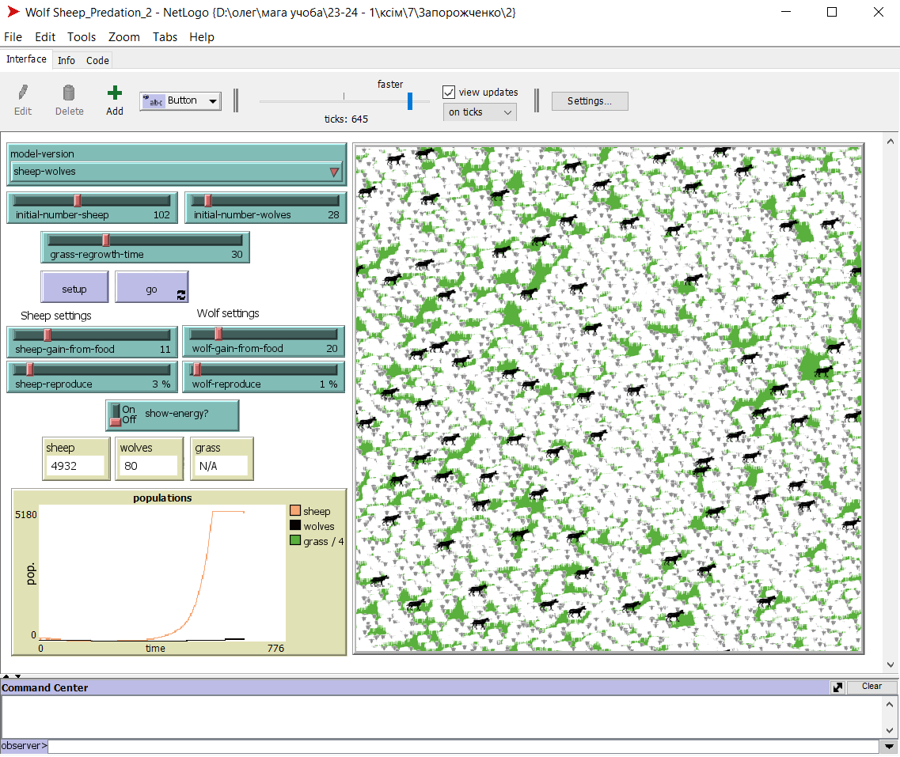
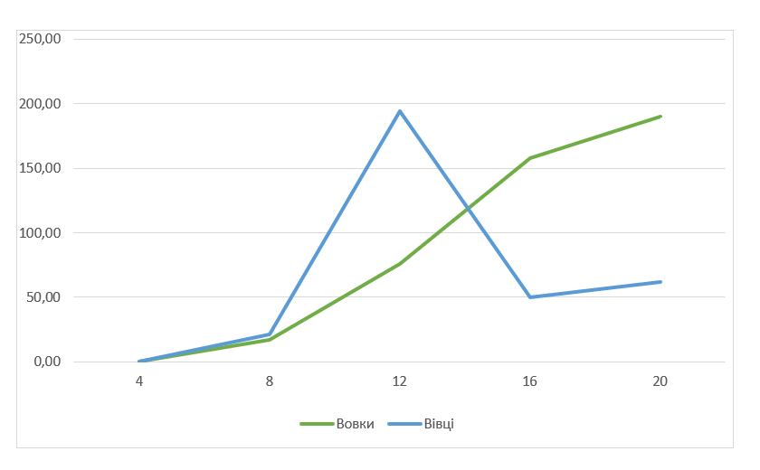

## Комп'ютерні системи імітаційного моделювання
## СПм-23-5, **Чхеідзе Важа Олександрович**
### Лабораторна робота №**2**. Редагування імітаційних моделей у середовищі NetLogo

 

### Варіант 7, модель у середовищі NetLogo:
[Wolf Sheep Predation](http://www.netlogoweb.org/launch#http://www.netlogoweb.org/assets/modelslib/Sample%20Models/Biology/Wolf%20Sheep%20Predation.nlogo).

 

### Внесені зміни у вихідну логіку моделі, за варіантом:

**Прибрати "зграйність" вовків**

Тепер перед початком свого ходу вовки повинні "оглядатися", перевіряючи оточення, та обирати напрямок руху виходячи з наявності вівець та відсутності інших вовків. Якщо немає іншої можливості – переміщається випадково. При знаходженні на одній ділянці поля двох вовків залишається лише один з них. Для цього створену нову процедуру wolf-move:
<pre> 
to wolf-move
  ; Знаходження оточуючих вовків та овець в радіусі 3 патчів
  let nearby-sheep sheep in-radius 3
  let nearby-wolves other wolves in-radius 3

  ; Якщо є вівці, але немає вовків поруч
  ifelse any? nearby-sheep and not any? nearby-wolves
  [
    ; Вибір однієї з ближчих вівців як ціль
    let target one-of nearby-sheep
    ; Обертання в напрямку цілі та рух на один крок вперед
    face target
    fd 1
  ] 
  ; Якщо немає вівців або є і вовки, то просто рухатися
  [
    move
  ]
  
  ; Якщо є вовки поруч
  if any? nearby-wolves 
  [
    ; Вибір одного з ближчих вовків як ціль
    let target one-of nearby-wolves
    ; Обертання в протиженому напрямку від цілі та рух на один крок вперед
    face target
    rt 180 
    fd 1
    
    ; Перевірка, чи є інший вовк поруч на тому ж самому патчі
    let other-wolf one-of nearby-wolves
    let patch-of-other-wolf [patch-here] of other-wolf
    if patch-of-other-wolf = patch-here
    [ 
      ; Якщо інший вовк на тому ж самому патчі, то померти
      die 
    ]
  ]
end
</pre>

**Змінити переміщення овець**

Вівці переміщаються випадковим чином, але при виявленні вовка на одній із клітин поруч змінюють напрямок на протилежний.  Для цього створену нову процедуру sheep-move:
<pre>
to sheep-move
  ; Визначаємо змінну nearby-wolves, що містить список вовків в радіусі 1 одиниці від вівці
  let nearby-wolves wolves in-radius 1
  
  ; Перевіряємо, чи існують вовки в радіусі 1
  ifelse any? wolves in-radius 1 
  [
    ; Якщо є вовки, вибираємо одного з них (target)
    let target one-of nearby-wolves
    ; Обертаємо вівці так, щоб вона бачила вибраного вовка
    face target
    ; Робимо поворот на 180 градусів (для уникнення вовків)
    rt 180 
    ; Рухаємо вівці вперед на одиницю відстані
    fd 1
  ]
  ; Якщо вовків немає в радіусі 1, просто рухаємо вівці (продовжуємо її звичайний рух)
  [move]
end
</pre>

### Внесені зміни у вихідну логіку моделі, на власний розсуд:

**Оптимізація моделі та зміна логіки відтворення овець**
Змінена максимальна кількість овець на полі. Тепер їх максимальна кількість 5 000. Що звісно і так багато, але до цього було 30 000.
<pre>
  to setup
  clear-all
  set max-sheep 5000
  ...
</pre>

Також змінена процедура reproduce-sheep - розмноження овець. Тепер вівці можуть розмножуватись лише коли їх менше максимального значення. Більше не буде виникати ситуацій, якщо на полі є хоч один вовк, то овець може бути безкінечно багато.
<pre>
  to reproduce-sheep  ; sheep procedure
  if count sheep < max-sheep[
  if random-float 100 < sheep-reproduce [  ; throw "dice" to see if you will reproduce
    set energy (energy / 2)                ; divide energy between parent and offspring
    hatch 1 [ rt random-float 360 fd 1 ]   ; hatch an offspring and move it forward 1 step
  ]
  ]
end
</pre>

Фінальний код моделі та її інтерфейс доступні за [посиланням](Wolf_Sheep_Predation_2.nlogo).
 

## Обчислювальні експерименти 
### 1. Вплив шансу відворення овець на популяції тварин
Досліджується залежність популяцій тварин від шансу відворення овець протягом певної кількості тактів (300)
Експерименти проводяться при 4-20% шансу відворення овець, з кроком 4, усього 5 симуляцій.  
Інші керуючі параметри мають значення за замовчуванням:
- **model-version** "sheep-wolves-grass"
- **initial-number-sheep** 100
- **initial-number-wolves** 50
- **sheep-gain-from-food** 4
- **wolf-gain-from-food** 20
- **grass-regrowth-time** 30
- **wolf-reproduce** 5
- **show-energy?** off

<table>
<thead>
<tr><th>Шанс відворення овець</th><th>Вовки</th><th>Вівці</th></tr>
</thead>
<tbody>
<tr><td>4</td><td>0</td><td>0</td></tr>
<tr><td>8</td><td>17</td><td>21</td></tr>
<tr><td>12</td><td>76</td><td>194</td></tr>
<tr><td>16</td><td>158</td><td>50</td></tr>
<tr><td>20</td><td>190</td><td>62</td></tr>
</tbody>
</table>

Графік наочно показує, що зростання шансу відворення овець сприяє збільшенню популяції вовків. Це може бути пов'язано з тим, що більше доступних овець стає джерелом їжі для вовків, що призводить до їхнього розмноження. Окрім того, через зміни у лозіці моделі, вовки стали кращими у полюванні на овець, і тому дуже низький рівень відтворення овець призводить до їх вимирання.
